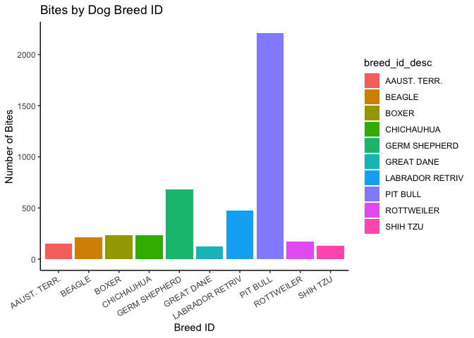

```r
library(tidyverse)
```

```
## ── Attaching packages ─────────────────────────────────────── tidyverse 1.3.1 ──
```

```
## ✓ ggplot2 3.3.5     ✓ purrr   0.3.4
## ✓ tibble  3.1.6     ✓ dplyr   1.0.8
## ✓ tidyr   1.2.0     ✓ stringr 1.4.0
## ✓ readr   2.1.2     ✓ forcats 0.5.1
```

```
## ── Conflicts ────────────────────────────────────────── tidyverse_conflicts() ──
## x dplyr::filter() masks stats::filter()
## x dplyr::lag()    masks stats::lag()
```

```r
library(RColorBrewer)
library(paletteer)
library(janitor)
```

```
## 
## Attaching package: 'janitor'
```

```
## The following objects are masked from 'package:stats':
## 
##     chisq.test, fisher.test
```

```r
library(here)
```

```
## here() starts at /Users/jaynatoye/Documents/GitHub/GitHub/Project/BIS15W2022_group3
```

```r
library(ggmap)
```

```
## Google's Terms of Service: https://cloud.google.com/maps-platform/terms/.
```

```
## Please cite ggmap if you use it! See citation("ggmap") for details.
```

```r
library(ggwordcloud)
```


```r
animal_bites <- readr::read_csv("data/Animal_Bites.csv")%>%clean_names()
```

```
## Warning: One or more parsing issues, see `problems()` for details
```

```
## Rows: 12074 Columns: 18
## ── Column specification ────────────────────────────────────────────────────────
## Delimiter: ","
## chr  (9): SpeciesIDDesc, BreedIDDesc, breed, GenderIDDesc, color, AdvIssuedY...
## dbl  (3): id, vaccination_yrs, victim_zip
## lgl  (1): DispositionIDDesc
## dttm (5): bite_date, vaccination_date, quarantine_date, head_sent_date, rele...
## 
## ℹ Use `spec()` to retrieve the full column specification for this data.
## ℹ Specify the column types or set `show_col_types = FALSE` to quiet this message.
```

```r
animal_bites
```

```
## # A tibble: 12,074 × 18
##        id bite_date           species_id_desc breed_id_desc breed gender_id_desc
##     <dbl> <dttm>              <chr>           <chr>         <chr> <chr>         
##  1 518378 2012-06-30 00:00:00 SKUNK           <NA>          SKUNK MALE          
##  2 518378 2012-06-30 00:00:00 SKUNK           <NA>          SKUNK MALE          
##  3 571527 2014-11-01 00:00:00 DOG             <NA>          BEAG… FEMALE        
##  4 571527 2014-11-01 00:00:00 DOG             <NA>          BEAG… FEMALE        
##  5 577969 2015-03-14 00:00:00 DOG             <NA>          <NA>  <NA>          
##  6 577969 2015-03-14 00:00:00 DOG             <NA>          <NA>  <NA>          
##  7 581174 2015-04-26 00:00:00 DOG             BEAGLE        MIX   MALE          
##  8 581174 2015-04-26 00:00:00 DOG             BEAGLE        MIX   MALE          
##  9 585126 2015-06-27 00:00:00 DOG             LABRADOR RET… MIX   MALE          
## 10 585126 2015-06-27 00:00:00 DOG             LABRADOR RET… MIX   MALE          
## # … with 12,064 more rows, and 12 more variables: color <chr>,
## #   vaccination_yrs <dbl>, vaccination_date <dttm>, victim_zip <dbl>,
## #   adv_issued_yn_desc <chr>, where_bitten_id_desc <chr>,
## #   quarantine_date <dttm>, disposition_id_desc <lgl>, head_sent_date <dttm>,
## #   release_date <dttm>, results_id_desc <chr>, followup_yn_desc <chr>
```
#Cleaning up the Data

```r
animal_bites <- animal_bites%>%
  naniar::replace_with_na(replace=list(gender_id_desc="UNKNOWN", results_id_desc="UNKNOWN", disposition_id_desc="UNKNOWN", vaccination_date="<NA>", head_sent_date="<NA>", release_date="<NA>"))
animal_bites
```

```
## # A tibble: 12,074 × 18
##        id bite_date           species_id_desc breed_id_desc breed gender_id_desc
##     <dbl> <dttm>              <chr>           <chr>         <chr> <chr>         
##  1 518378 2012-06-30 00:00:00 SKUNK           <NA>          SKUNK MALE          
##  2 518378 2012-06-30 00:00:00 SKUNK           <NA>          SKUNK MALE          
##  3 571527 2014-11-01 00:00:00 DOG             <NA>          BEAG… FEMALE        
##  4 571527 2014-11-01 00:00:00 DOG             <NA>          BEAG… FEMALE        
##  5 577969 2015-03-14 00:00:00 DOG             <NA>          <NA>  <NA>          
##  6 577969 2015-03-14 00:00:00 DOG             <NA>          <NA>  <NA>          
##  7 581174 2015-04-26 00:00:00 DOG             BEAGLE        MIX   MALE          
##  8 581174 2015-04-26 00:00:00 DOG             BEAGLE        MIX   MALE          
##  9 585126 2015-06-27 00:00:00 DOG             LABRADOR RET… MIX   MALE          
## 10 585126 2015-06-27 00:00:00 DOG             LABRADOR RET… MIX   MALE          
## # … with 12,064 more rows, and 12 more variables: color <chr>,
## #   vaccination_yrs <dbl>, vaccination_date <dttm>, victim_zip <dbl>,
## #   adv_issued_yn_desc <chr>, where_bitten_id_desc <chr>,
## #   quarantine_date <dttm>, disposition_id_desc <lgl>, head_sent_date <dttm>,
## #   release_date <dttm>, results_id_desc <chr>, followup_yn_desc <chr>
```


```r
animal_bites%>%
  naniar::miss_var_summary()
```

```
## # A tibble: 18 × 3
##    variable             n_miss pct_miss
##    <chr>                 <int>    <dbl>
##  1 disposition_id_desc   12074  100    
##  2 quarantine_date       12002   99.4  
##  3 adv_issued_yn_desc    11814   97.8  
##  4 results_id_desc       11134   92.2  
##  5 head_sent_date        11084   91.8  
##  6 breed                  9526   78.9  
##  7 vaccination_yrs        8532   70.7  
##  8 vaccination_date       7864   65.1  
##  9 release_date           7356   60.9  
## 10 breed_id_desc          5524   45.8  
## 11 gender_id_desc         4566   37.8  
## 12 color                  3134   26.0  
## 13 where_bitten_id_desc   1094    9.06 
## 14 bite_date               926    7.67 
## 15 victim_zip              336    2.78 
## 16 species_id_desc          72    0.596
## 17 id                        0    0    
## 18 followup_yn_desc          0    0
```
Most of the results from the rabies test are missing as well as when the sample was sent in to the lab. 


```r
animal_bites <- animal_bites%>%
  separate(bite_date, into=c("bite_year", "bite_month", "bite_day"), sep = "-")
animal_bites
```

```
## # A tibble: 12,074 × 20
##        id bite_year bite_month bite_day species_id_desc breed_id_desc   breed   
##     <dbl> <chr>     <chr>      <chr>    <chr>           <chr>           <chr>   
##  1 518378 2012      06         30       SKUNK           <NA>            SKUNK   
##  2 518378 2012      06         30       SKUNK           <NA>            SKUNK   
##  3 571527 2014      11         01       DOG             <NA>            BEAGLE …
##  4 571527 2014      11         01       DOG             <NA>            BEAGLE …
##  5 577969 2015      03         14       DOG             <NA>            <NA>    
##  6 577969 2015      03         14       DOG             <NA>            <NA>    
##  7 581174 2015      04         26       DOG             BEAGLE          MIX     
##  8 581174 2015      04         26       DOG             BEAGLE          MIX     
##  9 585126 2015      06         27       DOG             LABRADOR RETRIV MIX     
## 10 585126 2015      06         27       DOG             LABRADOR RETRIV MIX     
## # … with 12,064 more rows, and 13 more variables: gender_id_desc <chr>,
## #   color <chr>, vaccination_yrs <dbl>, vaccination_date <dttm>,
## #   victim_zip <dbl>, adv_issued_yn_desc <chr>, where_bitten_id_desc <chr>,
## #   quarantine_date <dttm>, disposition_id_desc <lgl>, head_sent_date <dttm>,
## #   release_date <dttm>, results_id_desc <chr>, followup_yn_desc <chr>
```

#Questions we wanted to ask
What are the results of the rabies test? 

```r
animal_bites%>%
  count(results_id_desc)
```

```
## # A tibble: 3 × 2
##   results_id_desc     n
##   <chr>           <int>
## 1 NEGATIVE          916
## 2 POSITIVE           24
## 3 <NA>            11134
```

```r
animal_bites%>%
   filter(results_id_desc!="NA")%>%
  ggplot(aes(results_id_desc, fill=results_id_desc)) + geom_bar() + labs(title="Rabies Test Results", x="Results", y="Number of Reports") + theme_classic()
```

<!-- -->

```r
animal_bites%>%
  ggplot(aes(results_id_desc, fill=results_id_desc)) + geom_bar() + labs(title="Rabies Test Results (with NA)", x="Results", y="Number of Reports") + theme_classic()
```

<!-- -->

What animal has the most reported bites? 


```r
animal_bites%>%
  count(species_id_desc)%>%
  arrange(desc(n))
```

```
## # A tibble: 10 × 2
##    species_id_desc     n
##    <chr>           <int>
##  1 DOG              9458
##  2 CAT              1760
##  3 BAT               674
##  4 <NA>               72
##  5 RACCOON            54
##  6 OTHER              26
##  7 FERRET             14
##  8 SKUNK               8
##  9 HORSE               4
## 10 RAT                 4
```


```r
animal_bites%>%
  select(species_id_desc)%>%
  ggplot(aes(species_id_desc, fill=species_id_desc)) + geom_bar() + labs(title="Bite Reports by Animal Species", x="Species", y="Number of Reports" )
```

<!-- -->


```r
animal_species_cloud <- animal_bites%>%
  count(species_id_desc)
animal_species_cloud
```

```
## # A tibble: 10 × 2
##    species_id_desc     n
##    <chr>           <int>
##  1 BAT               674
##  2 CAT              1760
##  3 DOG              9458
##  4 FERRET             14
##  5 HORSE               4
##  6 OTHER              26
##  7 RACCOON            54
##  8 RAT                 4
##  9 SKUNK               8
## 10 <NA>               72
```


```r
animal_species_cloud%>%
  ggplot(aes(label=species_id_desc, size=n, color=species_id_desc)) + geom_text_wordcloud() + scale_size_area(max_size = 50) + theme_minimal()
```

```
## Warning: Removed 1 rows containing missing values (geom_text_wordcloud).
```

```
## Warning in wordcloud_boxes(data_points = points_valid_first, boxes = boxes, :
## One word could not fit on page. It has been placed at its original position.
```

<!-- -->

What animal has the most positive tests for rabies?

```r
animal_bites%>%
  select(species_id_desc, results_id_desc)%>%
  filter(results_id_desc=="POSITIVE")%>%
  count(species_id_desc)
```

```
## # A tibble: 2 × 2
##   species_id_desc     n
##   <chr>           <int>
## 1 BAT                22
## 2 DOG                 2
```

```r
animal_bites%>%
  select(species_id_desc, results_id_desc)%>%
  filter(results_id_desc=="POSITIVE")%>%
  ggplot(aes(species_id_desc, fill=species_id_desc)) + geom_bar() + labs(title="Positive Cases by Species", x="Species", y="Count") + theme_classic()
```

<!-- -->


What breed of dog has the most reported bites?

```r
animal_bites%>%
  filter(species_id_desc=="DOG")
```

```
## # A tibble: 9,458 × 20
##        id bite_year bite_month bite_day species_id_desc breed_id_desc   breed   
##     <dbl> <chr>     <chr>      <chr>    <chr>           <chr>           <chr>   
##  1 571527 2014      11         01       DOG             <NA>            BEAGLE …
##  2 571527 2014      11         01       DOG             <NA>            BEAGLE …
##  3 577969 2015      03         14       DOG             <NA>            <NA>    
##  4 577969 2015      03         14       DOG             <NA>            <NA>    
##  5 581174 2015      04         26       DOG             BEAGLE          MIX     
##  6 581174 2015      04         26       DOG             BEAGLE          MIX     
##  7 585126 2015      06         27       DOG             LABRADOR RETRIV MIX     
##  8 585126 2015      06         27       DOG             LABRADOR RETRIV MIX     
##  9 605326 2016      05         21       DOG             COON HOUND      <NA>    
## 10 605326 2016      05         21       DOG             COON HOUND      <NA>    
## # … with 9,448 more rows, and 13 more variables: gender_id_desc <chr>,
## #   color <chr>, vaccination_yrs <dbl>, vaccination_date <dttm>,
## #   victim_zip <dbl>, adv_issued_yn_desc <chr>, where_bitten_id_desc <chr>,
## #   quarantine_date <dttm>, disposition_id_desc <lgl>, head_sent_date <dttm>,
## #   release_date <dttm>, results_id_desc <chr>, followup_yn_desc <chr>
```


```r
top_breed_id <- animal_bites%>%
  filter(species_id_desc=="DOG")%>%
  count(breed_id_desc)%>%
  arrange(desc(n))%>%
  top_n(11)%>%
  filter(breed_id_desc!="NA")
```

```
## Selecting by n
```

```r
top_breed_id
```

```
## # A tibble: 10 × 2
##    breed_id_desc       n
##    <chr>           <int>
##  1 PIT BULL         2210
##  2 GERM SHEPHERD     682
##  3 LABRADOR RETRIV   474
##  4 BOXER             236
##  5 CHICHAUHUA        232
##  6 BEAGLE            214
##  7 ROTTWEILER        172
##  8 AAUST. TERR.      150
##  9 SHIH TZU          134
## 10 GREAT DANE        124
```


```r
top_breed_id%>%
  ggplot(aes(x=breed_id_desc, y=n, fill=breed_id_desc)) + geom_col() +labs(title="Bites by Dog Breed ID", x="Breed ID", y="Number of Bites") + theme_classic() + theme(axis.text.x = element_text(angle = 30, hjust = 1)) 
```

<!-- -->

```r
top_breed <- animal_bites%>%
  filter(species_id_desc=="DOG")%>%
  count(breed)%>%
  arrange(desc(n))%>%
  top_n(11)%>%
  filter(breed!="NA")
```

```
## Selecting by n
```

```r
top_breed
```

```
## # A tibble: 10 × 2
##    breed             n
##    <chr>         <int>
##  1 MIX             716
##  2 MIXED           110
##  3 JACK RUS         54
##  4 LAB MIX          54
##  5 HOUND MIX        40
##  6 GOLDEN DOODLE    30
##  7 TERRIER          30
##  8 STAFFORDSHIRE    28
##  9 JACK RUSSELL     26
## 10 BOXER MIX        22
```

```r
top_breed%>%
  ggplot(aes(x=breed, y=n, fill=breed)) + geom_col() +labs(title="Bites by Dog Breed", x="Breed", y="Number of Bites") + theme_classic() + theme(axis.text.x = element_text(angle = 30, hjust = 1)) 
```

<!-- -->

Where was data collected from? 


```r
animal_bites%>%
  count(victim_zip)%>%
  arrange(desc(n))%>%
  top_n(10
        )
```

```
## Selecting by n
```

```
## # A tibble: 10 × 2
##    victim_zip     n
##         <dbl> <int>
##  1      40272   634
##  2      40299   608
##  3      40214   588
##  4      40291   586
##  5      40216   578
##  6      40219   484
##  7      40215   476
##  8      40229   462
##  9      40218   436
## 10      40245   422
```


```r
zipcodes <- readr::read_csv("data/zipcodes  - Sheet1.csv")%>%
  clean_names()
```

```
## Rows: 10 Columns: 3
## ── Column specification ────────────────────────────────────────────────────────
## Delimiter: ","
## dbl (3): victim zip, lat, long
## 
## ℹ Use `spec()` to retrieve the full column specification for this data.
## ℹ Specify the column types or set `show_col_types = FALSE` to quiet this message.
```


```r
zipcodes%>%
  summary()
```

```
##    victim_zip         lat             long       
##  Min.   :40214   Min.   :38.08   Min.   :-85.86  
##  1st Qu.:40216   1st Qu.:38.13   1st Qu.:-85.79  
##  Median :40224   Median :38.16   Median :-85.67  
##  Mean   :40242   Mean   :38.16   Mean   :-85.68  
##  3rd Qu.:40265   3rd Qu.:38.19   3rd Qu.:-85.59  
##  Max.   :40299   Max.   :38.26   Max.   :-85.45
```


```r
lat <- c(38.08, 38.26)
long <- c(-85.86, -85.45)
bbox <- make_bbox(long, lat, f=0.05)
```

```r
map1 <- get_map(bbox, maptype = "terrain", source = "stamen")
```

```
## Map tiles by Stamen Design, under CC BY 3.0. Data by OpenStreetMap, under ODbL.
```

```r
ggmap(map1)
```

<!-- -->

```r
ggmap(map1) + geom_point(data=zipcodes, aes(long, lat), color="blue", size=3) + labs(title="Location of Bites Reported", x="Longitude", y="Latitude")
```

<!-- -->

When was data collected?

```r
animal_bites%>%
  count(bite_year)%>%
  arrange(bite_year)
```

```
## # A tibble: 24 × 2
##    bite_year     n
##    <chr>     <int>
##  1 1949          2
##  2 1950          2
##  3 1952          2
##  4 1971          2
##  5 1981          2
##  6 1984          2
##  7 1986          2
##  8 2001          6
##  9 2003          2
## 10 2005          2
## # … with 14 more rows
```

```r
animal_bites$bite_year <- as.factor(animal_bites$bite_year)
```


```r
animal_bites%>%
  filter(bite_year!="5013")%>%
  filter(bite_year!="2201")%>%
  filter(bite_year!="2101")%>%
  filter(bite_year!="1952")%>%
  filter(bite_year!="2029")%>%
  ggplot(aes(bite_year, fill=bite_month)) + geom_bar() + labs(title="Dates of Data Collection", x= "Bite Year", y="Number of Bites")+ theme_classic() + theme(axis.text.x = element_text(angle=30))
```

<!-- -->

Vaccination rates? 

```r
animal_bites%>%
  count(vaccination_yrs)
```

```
## # A tibble: 5 × 2
##   vaccination_yrs     n
##             <dbl> <int>
## 1               1  2622
## 2               2     2
## 3               3   916
## 4               8     2
## 5              NA  8532
```

```r
animal_bites%>%
  filter(vaccination_yrs=="3")
```

```
## # A tibble: 916 × 20
##        id bite_year bite_month bite_day species_id_desc breed_id_desc   breed
##     <dbl> <fct>     <chr>      <chr>    <chr>           <chr>           <chr>
##  1 622499 2017      02         05       DOG             LABRADOR RETRIV MIX  
##  2 622499 2017      02         05       DOG             LABRADOR RETRIV MIX  
##  3 622840 2017      02         10       DOG             LABRADOR RETRIV <NA> 
##  4 622840 2017      02         10       DOG             LABRADOR RETRIV <NA> 
##  5 623128 2017      02         13       DOG             PIT BULL        <NA> 
##  6 623128 2017      02         13       DOG             PIT BULL        <NA> 
##  7 623191 2017      02         18       DOG             LABRADOR RETRIV <NA> 
##  8 623191 2017      02         18       DOG             LABRADOR RETRIV <NA> 
##  9 623929 2017      03         01       DOG             CHICHAUHUA      <NA> 
## 10 623929 2017      03         01       DOG             CHICHAUHUA      <NA> 
## # … with 906 more rows, and 13 more variables: gender_id_desc <chr>,
## #   color <chr>, vaccination_yrs <dbl>, vaccination_date <dttm>,
## #   victim_zip <dbl>, adv_issued_yn_desc <chr>, where_bitten_id_desc <chr>,
## #   quarantine_date <dttm>, disposition_id_desc <lgl>, head_sent_date <dttm>,
## #   release_date <dttm>, results_id_desc <chr>, followup_yn_desc <chr>
```

```r
animal_bites%>%
  filter(results_id_desc=="POSITIVE")
```

```
## # A tibble: 24 × 20
##        id bite_year bite_month bite_day species_id_desc breed_id_desc   breed
##     <dbl> <fct>     <chr>      <chr>    <chr>           <chr>           <chr>
##  1 627719 2017      04         29       DOG             GREAT PYRENEESE <NA> 
##  2 627719 2017      04         29       DOG             GREAT PYRENEESE <NA> 
##  3 679267 <NA>      <NA>       <NA>     BAT             <NA>            <NA> 
##  4 679267 <NA>      <NA>       <NA>     BAT             <NA>            <NA> 
##  5 682696 <NA>      <NA>       <NA>     BAT             <NA>            <NA> 
##  6 682696 <NA>      <NA>       <NA>     BAT             <NA>            <NA> 
##  7 682889 <NA>      <NA>       <NA>     BAT             <NA>            <NA> 
##  8 682889 <NA>      <NA>       <NA>     BAT             <NA>            <NA> 
##  9 683374 <NA>      <NA>       <NA>     BAT             <NA>            <NA> 
## 10 683374 <NA>      <NA>       <NA>     BAT             <NA>            <NA> 
## # … with 14 more rows, and 13 more variables: gender_id_desc <chr>,
## #   color <chr>, vaccination_yrs <dbl>, vaccination_date <dttm>,
## #   victim_zip <dbl>, adv_issued_yn_desc <chr>, where_bitten_id_desc <chr>,
## #   quarantine_date <dttm>, disposition_id_desc <lgl>, head_sent_date <dttm>,
## #   release_date <dttm>, results_id_desc <chr>, followup_yn_desc <chr>
```


```r
animal_bites%>%
  select(species_id_desc, vaccination_yrs, results_id_desc)%>%
  filter(species_id_desc=="DOG" | species_id_desc=="CAT"| species_id_desc=="FERRET"|species_id_desc=="HORSE")%>%
  filter(results_id_desc=="POSITIVE" | results_id_desc=="NEGATIVE")
```

```
## # A tibble: 362 × 3
##    species_id_desc vaccination_yrs results_id_desc
##    <chr>                     <dbl> <chr>          
##  1 DOG                          NA NEGATIVE       
##  2 DOG                          NA NEGATIVE       
##  3 DOG                          NA NEGATIVE       
##  4 DOG                          NA NEGATIVE       
##  5 DOG                          NA NEGATIVE       
##  6 DOG                          NA NEGATIVE       
##  7 DOG                          NA NEGATIVE       
##  8 DOG                          NA NEGATIVE       
##  9 DOG                          NA POSITIVE       
## 10 DOG                          NA POSITIVE       
## # … with 352 more rows
```


#Take Away
PLEASE if you ever go into research and imputing data, be accurate when imputing your data. 
Also try to record your data and not leave things blank.
Also please get your pets vaccinated. 

#Thank you so much! 

